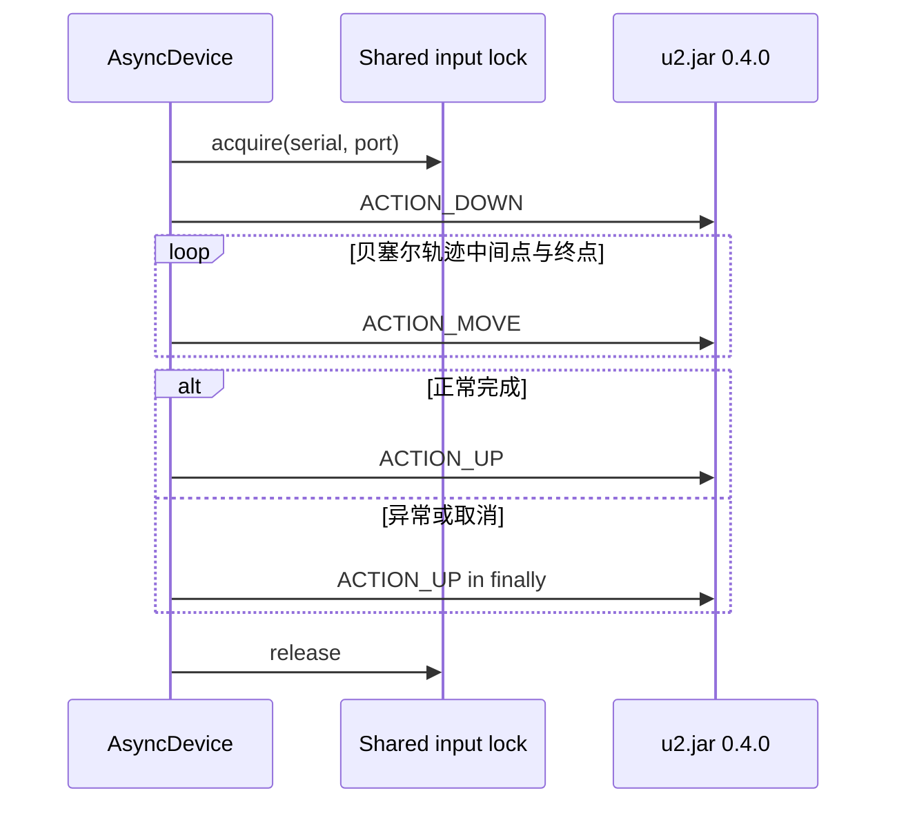

# async-uiautomator2 架构设计

## 总体结构

项目采用分层架构：

```text
用户代码
  |
  v
AsyncDevice / AsyncUiObject / AsyncXPathSelector
  |
  v
AsyncBasicUiautomatorServer
  |
  v
AsyncAdbHTTPClient
  |
  v
AsyncAdbDevice backend
  |
  v
ADB transport -> u2.jar:<port>
```

核心原则：

- 上层 API 只依赖协议，不依赖具体 ADB 库。
- `u2.jar` 生命周期和 JSON-RPC 重试集中在 server 层。
- selector 和 XPath 只负责元素表达，不直接管理 ADB。
- 同步兼容通过 backend 隔离，不污染上层 async API。

## 模块职责

### `adb.py`

定义 ADB backend 协议和第一阶段线程包装实现。

建议公开：

```python
class AsyncConnection(Protocol):
    async def sendall(self, data: bytes) -> None: ...
    async def recv(self, size: int) -> bytes: ...
    async def close(self) -> None: ...


class AsyncAdbDevice(Protocol):
    serial: str | None

    async def create_connection(self, network: Any, address: int | str) -> AsyncConnection: ...
    async def shell(self, cmd: str | list[str], timeout: float = 60) -> str: ...
    async def shell_stream(self, cmd: str | list[str]) -> Any: ...
    async def push(self, src: str | Path, dst: str, mode: int = 0o644, check: bool = False) -> None: ...
    async def app_start(self, package_name: str) -> Any: ...
```

第一阶段实现：

- `ThreadedAdbDevice`
- `AsyncSocketConnection`
- `ThreadedAdbProcess`

注意：

- `shell_stream()` 启动 `u2.jar` 时不要使用默认线程池中永久阻塞的 `recv()`。
- 可以使用 daemon thread 读取 stream 输出，`kill()` 关闭 ADB 连接。
- 长期应替换为纯 async stream。

### `http.py`

实现最小 ADB socket HTTP 客户端。

职责：

- 每个请求通过 `create_connection(TCP, port)` 建立设备端 socket，默认端口为 `9008`。
- 手写 HTTP/1.1 请求。
- 读取并解析 HTTP 响应。
- 实现 `GET /ping` 和 `POST /jsonrpc/0`。
- 将 JSON-RPC 错误映射为 Python 异常。

建议公开：

```python
class HTTPResponse:
    status: int
    reason: str
    headers: dict[str, str]
    content: bytes


class AsyncAdbHTTPClient:
    async def ping(self, timeout: float = 10) -> str: ...
    async def jsonrpc(self, method: str, params: Any, timeout: float = 10) -> Any: ...
    async def request(self, method: str, path: str, data: dict[str, Any] | None = None, timeout: float = 10) -> HTTPResponse: ...
```

不建议第一阶段引入 `httpx`，因为当前 uiautomator2 v3.7+ 的连接模型不是本地 HTTP 端口，而是 ADB socket 直连设备端端口。

### `server.py`

管理 `u2.jar` 生命周期。

职责：

- 检查和推送 `u2.jar`。
- 使用 `app_process ... Main -p <port>` 启动服务。
- 等待 `/ping` ready。
- 停止当前客户端持有的 stream。
- JSON-RPC 自动重启和重试一次。

关键状态：

```python
class AsyncBasicUiautomatorServer:
    device: AsyncAdbDevice
    http: AsyncAdbHTTPClient
    _process: Any
    _restart_lock: asyncio.Lock
    _generation: int
```

并发规则：

- 同一事件循环中，server 实例按 `(device.serial, port)` 共享生命周期锁和 generation。
- 相同设备端口的启动、停止和重启必须串行，不同设备或不同端口互不阻塞。
- 多个 RPC 同时发现服务不可用时，generation 已变化的实例复用其他实例的恢复结果。
- 同一个共享状态还持有独立的输入锁；它只串行 DOWN/MOVE/UP 原始触摸序列，
  不占用生命周期锁。

### `device.py`

面向用户的主入口。

职责：

- 组合 `AsyncAdbDevice` 和 `AsyncBasicUiautomatorServer`。
- 提供坐标点击、线性/多点/贝塞尔手势、shell、push、app_start 等常用方法。
- 提供 `select()` 和 `xpath()` 入口。
- 提供 async context manager。

建议：

- `info` 可以保持属性返回 coroutine：`await d.info`。
- `select()` 使用显式 keyword-only 参数。
- 不提供 `__call__(**kwargs)`。
- `close()` 默认只停止当前客户端启动的 `u2.jar` stream，不应该杀掉用户未授权的外部状态。

贝塞尔手势分为两条执行路径：

- 滑动：Python 生成、取整并去重轨迹，然后通过单次 `swipePoints` RPC 下发。
- 拖动：通过 `injectInputEvent` 拆分 DOWN、MOVE 和 UP；`finally` 负责异常或取消时
  的触点释放。



### `selector.py`

实现 typed selector 和异步 UI 对象。

职责：

- `SelectorQuery` 用 snake_case 字段描述 selector。
- `to_selector()` 转成 `uiautomator2._selector.Selector`。
- `AsyncUiObject` 封装 `objInfo`、`waitForExists`、`waitUntilGone`、坐标点击。

字段映射示例：

| typed 字段 | uiautomator2 字段 |
| --- | --- |
| `text_contains` | `textContains` |
| `class_name` | `className` |
| `resource_id` | `resourceId` |
| `package_name` | `packageName` |
| `long_clickable` | `longClickable` |

### `xpath.py`

实现异步 XPath。

职责：

- 通过 `dumpWindowHierarchy` 获取 XML。
- 复用 `uiautomator2.xpath` 的 `XPathSelector`、`PageSource`、`XMLElement`。
- 在 Python 侧匹配元素。
- 提供 bounds、rect、center 和 offset 几何能力，并用 bounds 计算点击坐标。
- 提供父节点导航、长按、文本替换和元素区域截图。
- 选择器级查询读取当前 XML；`AsyncXPathElement` 保存创建时的 XML 快照。

适用场景：

- 弹窗检测。
- 临时定位。
- 文本或 content-desc 模糊匹配。
- 多条件 XML 查询。

不适合：

- 高频固定控件操作。
- 对实时性要求很高的复杂 UI 轮询。

## 异常设计

第一阶段可以复用 `uiautomator2.exceptions`：

- `HTTPError`
- `HTTPTimeoutError`
- `UiAutomationNotConnectedError`
- `UiObjectNotFoundError`
- `XPathElementNotFoundError`
- `RPCInvalidError`
- `RPCUnknownError`

后续如果项目独立发布，可以在 `exceptions.py` 中继承或重新导出这些异常，避免用户必须直接依赖原包内部路径。

## 取消与超时

要求：

- 所有网络和 ADB I/O 边界必须支持 timeout。
- `AsyncAdbHTTPClient.request()` 应使用 `asyncio.wait_for()`。
- 取消 HTTP 请求时必须关闭 ADB socket。
- 取消长时间 shell / push 时，第一阶段只能保证事件循环不阻塞，不保证设备端命令回滚。
- `u2.jar` stream 的 `kill()` 必须关闭底层连接。

## 测试策略

优先使用 fake backend 单元测试，不要求每个测试都连真实设备。

必须覆盖：

- HTTP 请求格式和响应解析。
- JSON-RPC 错误映射。
- server 启动、ready、关闭。
- 并发 RPC 失败只触发一次重启。
- 相同设备端口的多实例共享生命周期锁，不同端口可以并发启动。
- 自定义端口被传入 HTTP 客户端和 `u2.jar` 启动命令。
- hierarchy 的两参数兼容调用和可选 `root_in_active` 三参数调用。
- 多点滑动的总时长换算、贝塞尔轨迹复现、坐标裁剪和连续重复点移除。
- 贝塞尔拖动的 DOWN/MOVE/UP 顺序、共享输入锁以及异常/取消时的 UP 释放。
- `ThreadedAdbProcess` 不创建阻塞事件循环退出的 asyncio task。
- typed selector 字段转换。
- `AsyncUiObject` 的 `exists/info/click/child/sibling`。
- XPath 的 `exists/info/all/click/wait`。
- 长 shell 和大文件 push 被取消时不阻塞事件循环。

真实设备测试单独放在 `tests/integration/`，默认不运行。

## 未来扩展

建议按优先级扩展：

1. `long_click`、`swipe`、`drag`。
2. `send_keys`、`set_text`、`clear_text`。
3. screenshot。
4. app install / uninstall / clear。
5. watcher 管理。
6. 纯 async ADB backend。
7. 同步桥接层。
